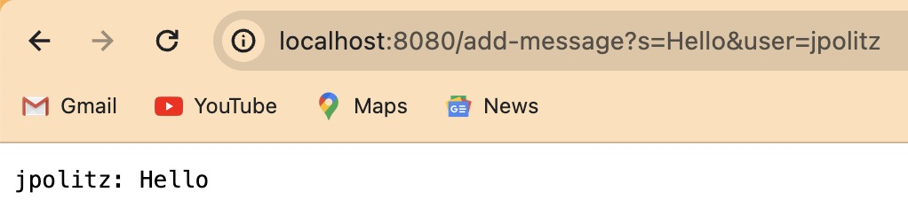
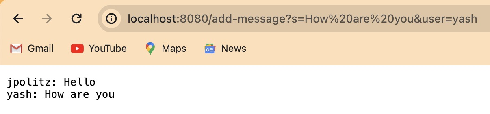
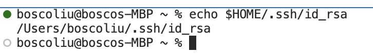
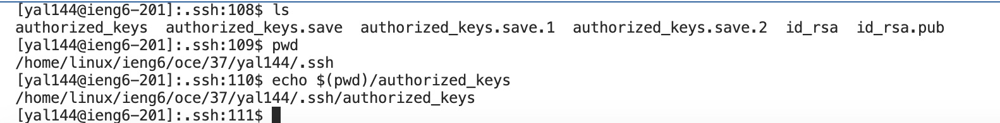
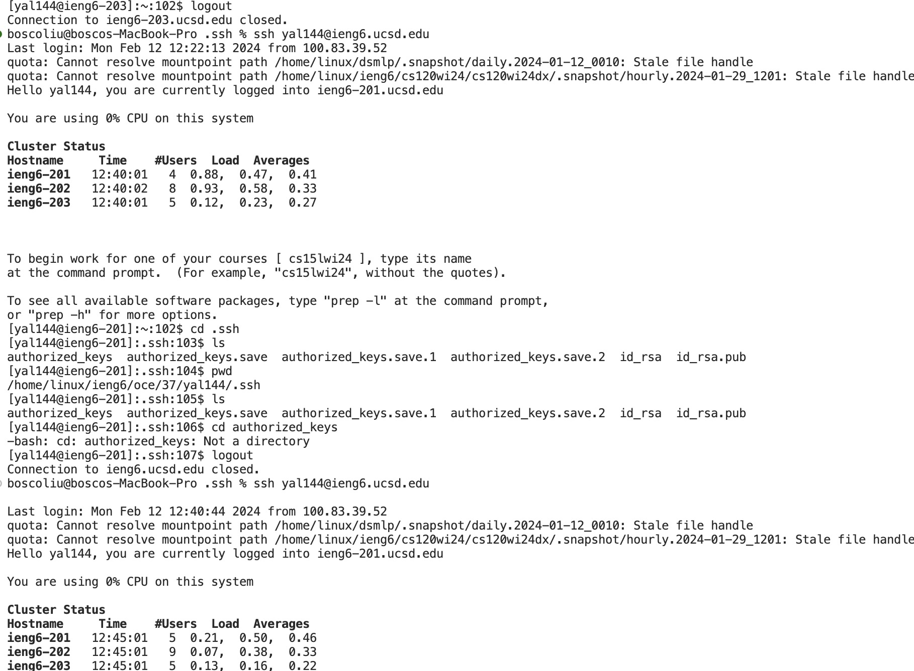

# Part 1:
##  code for StringServer：
```
import com.sun.net.httpserver.HttpExchange;
import com.sun.net.httpserver.HttpHandler;
import com.sun.net.httpserver.HttpServer;
import java.io.IOException;
import java.io.OutputStream;
import java.net.InetSocketAddress;
import java.util.HashMap;
import java.util.Map;

public class ChatServer {
    private static String chatHistory = "";

    public static void main(String[] args) throws IOException {
        HttpServer server = HttpServer.create(new InetSocketAddress(8080), 0);
        server.createContext("/add-message", new MessageHandler());
        server.setExecutor(null); // creat the first executor
        server.start();
        System.out.println("Server started on port 8080");
    }

    static class MessageHandler implements HttpHandler {
        @Override
        public void handle(HttpExchange exchange) throws IOException {
            if ("GET".equals(exchange.getRequestMethod())) {
                Map<String, String> queryParams = queryToMap(exchange.getRequestURI().getQuery());
                String user = queryParams.get("user");
                String message = queryParams.get("s");
                chatHistory += user + ": " + message + "\n";
                exchange.sendResponseHeaders(200, chatHistory.getBytes().length);
                OutputStream os = exchange.getResponseBody();
                os.write(chatHistory.getBytes());
                os.close();
            } else {
                exchange.sendResponseHeaders(405, -1); // 405 not allow 
            }
        }

        private Map<String, String> queryToMap(String query) {
            Map<String, String> result = new HashMap<>();
            for (String param : query.split("&")) {
                String[] entry = param.split("=");
                if (entry.length > 1) {
                    result.put(entry[0], entry[1]);
                } else {
                    result.put(entry[0], "");
                }
            }
            return result;
        }
    }
}
```
1.Hello



2.How are you



### a.Which methods in your code are called?
MessageHandler method.
### b.What are the relevant arguments to those methods, and the values of any relevant fields of the class?
Arguments: String query from the URL, including s (message) and user (username).
Relevant Fields:
String chatHistory for accumulating chat messages.
No int num in provided context; instead, chatHistory holds and accumulates messages.
### c.How do the values of any relevant fields of the class change from this specific request? If no values got changed, explain why.
Path: /add-message
Query Parameters: s=<message>&user=<user>
Example URL: http://localhost:8080/add-message?s=Hello&user=jpolitz
Field Updates:
chatHistory is updated with each request to append <user>: <message>\n. For the given URL, it appends "jpolitz: Hello\n" to chatHistory.
If there are subsequent requests, chatHistory updates with each new message. If a request does not match the path or lacks required parameters, chatHistory remains unchanged.

# Part 2:
### The path to the private key for your SSH key for logging into ieng6 (on your computer or on the home directory of the lab computer)



The absolute path to the private key is in `C:\Users\16264\.ssh\id_rsa`

### The absolute path to the public key for your SSH key for logging into ieng6 (this is the one you copied to your account on ieng6, so it should be a path on ieng6's file system)



The absolute path to the public key is in `/home/linux/ieng6/oce/37/yal144/.ssh\authorized_keys`

### A terminal interaction where you log into ieng6 with your course-specific account without being asked for a password.



# part 3
Using Linux for the first time, I knew nothing about commands, only cd, ls, pwd, etc. I also learned how to remote link: URLs and URIs. I also learned how to link remotely: URLs and URIs, which was very helpful, and I think this knowledge will help me in the future.
